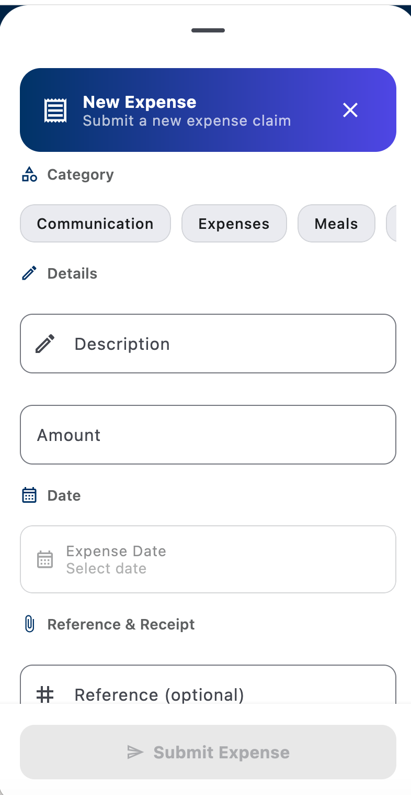
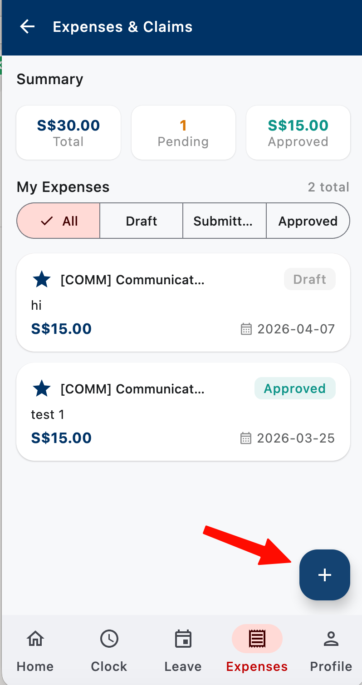

# Submit Expenses
{: .no_toc }

File expense claims with receipts. Approved claims are reimbursed in your next payroll cycle (or sooner, depending on company policy).
{: .fs-5 .fw-300 }

  
Table of contents

  {: .text-delta }
- TOC
{:toc}

---

## Submit an expense claim

1. Open the **MUST Mobile** app.
2. Tap the **Expenses** icon in the bottom navigation.
3. Tap **+ New Expense**.
4. Fill in:
   - **Category** — meal, transport, office supplies, etc.
   - **Amount** and **currency**
   - **Date** — when the expense happened
   - **Description** — what it was for (e.g. "client lunch — Acme Co.")
   - **Project / Cost center** — if your role requires it
5. **Attach the receipt** — take a photo or upload an existing image/PDF.
6. Tap **Submit**.

{: .d-block .mx-auto style="max-width: 320px;" }
*New Expense form — pick a category, enter amount, date, and attach a receipt before submitting.*
{: .text-center .fs-3 .text-grey-dk-000 }

> **Tip:** photograph your receipt right after the purchase. Thermal-printed receipts fade fast and may be unreadable by the time you claim.

## Expense categories

| Category | Typical examples |
|:---------|:-----------------|
| **Meals & Entertainment** | Meals while on site / during overtime / client meals (with approval) |
| **Medical Claims** | Clinic visits, medication, company-covered medical expenses |
| **Transport** | Taxi, ride-share, train, parking, tolls |
| **Accommodation** | Hotel for business travel |
| **Office Supplies** | Stationery, small equipment |
| **Communication** | Work SIM top-up, internet reimbursement |
| **Training** | Courses, books, conference fees |
| **Other** | Anything not listed — add a clear description |

## Attaching receipts

Every claim needs a receipt. Accepted formats:
- Photo from your phone camera (JPG, PNG)
- PDF export from email
- Screenshot of a digital receipt

**What the receipt must show:** vendor name, date, amount, and what was purchased. If any of these are missing, add a note in the description.

## Check claim status

Tap **Expenses** to see all your claims:

- **Draft** — saved but not submitted yet
- **Submitted** — waiting for manager approval
- **Approved** — waiting for finance to process payment
- **Paid** — reimbursed
- **Rejected** — tap to see the reason

{: .d-block .mx-auto style="max-width: 320px;" }
*The Summary strip at the top shows your totals (pending vs approved). Tap the **+** button bottom-right to create a new claim.*
{: .text-center .fs-3 .text-grey-dk-000 }

## Edit or delete a draft

Drafts are claims you saved but haven't submitted:

1. Go to **Expenses** → filter by **Draft**.
2. Tap the claim to edit, or swipe left to delete.

Once **Submitted**, you can't edit. If something's wrong, cancel (if still pending) and resubmit.

## Common issues

### "Receipt image is too large"
Resize the photo before uploading. Most phones have a built-in resize option in the Photos app, or use the in-app camera which auto-optimizes.

### "Exceeds category limit"
Your company has per-category caps (e.g. meals might be capped at $30). Split the claim or submit with a justification — your manager can override in some cases.

### Claim rejected for missing info
Read the rejection reason, fix the issue, and resubmit as a new claim. You can copy the details from the rejected one.

### Forgot to claim before cutoff
Company policies usually require claims within 30–60 days. Past the cutoff, contact HR — exceptions are case-by-case.

---

**Next:** [Attendance & Schedule →](attendance.html)
