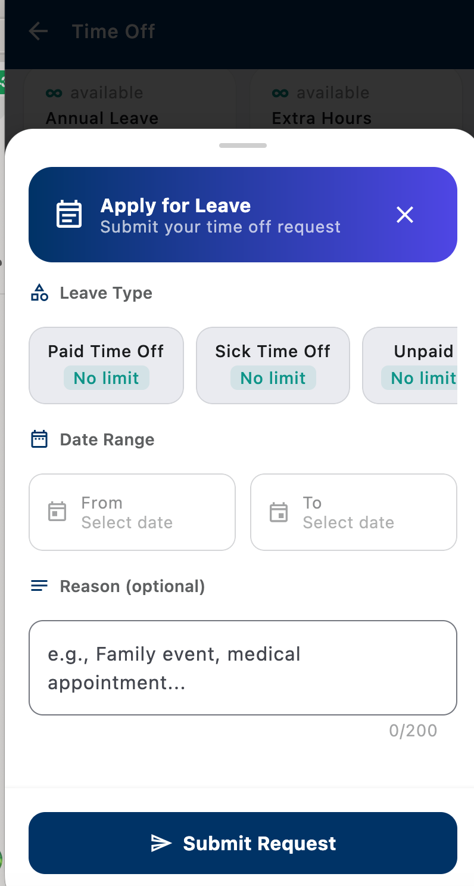
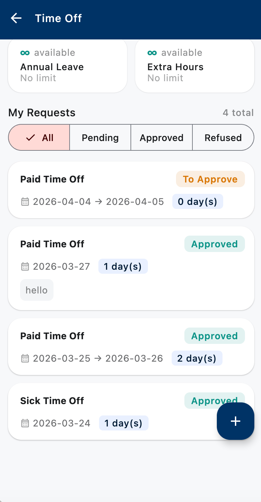

# Apply for Leave
{: .no_toc }

Submit leave requests directly from the app. Requests go to your manager for approval and update your leave balance automatically once approved.
{: .fs-5 .fw-300 }

  
Table of contents

  {: .text-delta }
- TOC
{:toc}

---

## Submit a leave request

1. Open the **MUST Mobile** app.
2. Tap the **Leave** icon in the bottom navigation.
3. Tap **+ New Request** (usually bottom-right).
4. Fill in:
   - **Leave Type** — annual, sick, unpaid, etc.
   - **From / To dates** — select from the calendar
   - **Half day?** — toggle if you're only taking a morning or afternoon
   - **Reason** — short description (required for some types)
5. Attach a supporting document if the leave type requires it (e.g. medical certificate for sick leave).
6. Tap **Submit**.

{: .d-block .mx-auto style="max-width: 320px;" }
*New leave request form — pick the type, date range, and optional reason.*
{: .text-center .fs-3 .text-grey-dk-000 }

## Leave types

| Type | When to use | Needs proof? |
|:-----|:------------|:-------------|
| **Annual leave** | Planned time off, vacation | No |
| **Sick leave** | Illness or medical appointment | Yes — MC must be attached, even for 1 day |
| **Unpaid leave** | When you've exhausted paid leave | Manager discretion |
| **Compassionate leave** | Family bereavement | Yes — death certificate must be attached |
| **Marriage leave** | Your own wedding | Marriage certificate |
| **Maternity / Paternity** | Childbirth | Birth documentation |

> The exact types available depend on your employment contract and country. If you don't see the type you need, contact HR.

## Check the status of your request

1. Tap **Leave** in the bottom nav.
2. You'll see a list of your requests with statuses:
   - **Pending** — waiting for manager approval
   - **Approved** — confirmed, your balance is updated
   - **Rejected** — see the reason by tapping the request
   - **Cancelled** — you or your manager cancelled it

{: .d-block .mx-auto style="max-width: 320px;" }
*Each card shows the leave type, date range, and status. Filter by All / Pending / Approved / Refused at the top.*
{: .text-center .fs-3 .text-grey-dk-000 }

## Cancel a pending request

If you haven't been approved yet and need to cancel:

1. Go to **Leave** → tap the pending request.
2. Tap **Cancel Request**.
3. Confirm.

Once approved, you **cannot cancel from the app** — contact HR.

## Check your leave balance

Your remaining days are shown at the top of the **Leave** screen, broken down by type (e.g. "Annual: 12 days left, Sick: 5 days left").

## Common issues

### "Insufficient balance"
You don't have enough days of that type. Options:
- Choose a shorter duration.
- Use a different leave type.
- Request unpaid leave.

### "Overlaps with existing request"
You already have a request covering some of those dates. Check your history and cancel the old one if it was a mistake.

### Manager hasn't approved
Wait 1–2 business days, then message your manager directly. The app doesn't escalate automatically.

---

**Next:** [Submit Expenses →](apply-expenses.html)
