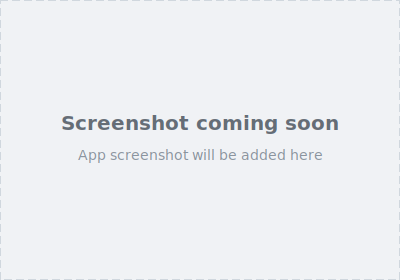

# Attendance & Schedule
{: .no_toc }

Check your attendance history, shift schedule, overtime, and working hours. Catch mistakes early — if a record is wrong, report it to HR within the same pay period.
{: .fs-5 .fw-300 }

  
Table of contents

  {: .text-delta }
- TOC
{:toc}

---

## View your attendance records

1. Open the **MUST Mobile** app.
2. Tap **Attendance** in the bottom navigation.
3. You'll see a list of your work days with:
   - Date
   - Clock-in time
   - Clock-out time
   - Total hours
   - Status (on time, late, early leave, overtime)

*Screenshot: Attendance records list*
{: .text-center .fs-3 .text-grey-dk-000 }

## Filter by date

- Tap the **calendar icon** at the top.
- Select a date range (e.g. this week, this month, custom).
- The list updates automatically.

## Understand the status indicators

| Indicator | Meaning |
|:----------|:--------|
| 🟢 **On Time** | You clocked in within the grace period |
| 🟡 **Late** | Clocked in after the grace period ended |
| 🟠 **Early Leave** | Clocked out before your scheduled end time |
| 🔵 **Overtime** | Worked beyond scheduled hours (pre-approved OT is counted separately) |
| ⚪ **Absent** | No clock-in for a scheduled workday |
| ⚫ **Leave** | Approved leave day (doesn't count as absent) |

> The exact grace periods and OT rules depend on your contract and local labor law. Ask HR if you're unsure.

## View your schedule / shift

1. Tap **Schedule** (may be inside the Attendance tab or the side menu).
2. You'll see your shifts laid out on a calendar:
   - Regular work days
   - Rest days
   - Public holidays
   - Pre-approved leave

*Screenshot: Schedule calendar view*
{: .text-center .fs-3 .text-grey-dk-000 }

Tap any day to see shift details (start time, end time, break, location).

## Export your records

If you need a copy for personal records or loan applications:

1. Go to **Attendance**.
2. Tap the **…** (menu) icon → **Export**.
3. Choose date range and format (PDF or Excel).
4. The file saves to your phone or can be emailed to yourself.

## Found an error in your record?

Do **not** try to "fix" it yourself. Attendance records are legal documents.

1. Screenshot the incorrect record.
2. Note what the correct time should be and why.
3. Contact HR with the screenshot and explanation.
4. HR will adjust the record and it will reflect in the app within a day.

Report errors **before the end of the pay period** — corrections after payroll is processed take longer.

## Common issues

### "No data for this date"
Either you weren't scheduled that day, or the sync hasn't caught up. Pull down on the list to refresh. Still nothing? Contact HR.

### Clock-out time is missing
You probably forgot to clock out. Contact HR — they can reconstruct the time from your schedule or ask you to confirm.

### Overtime not showing
Overtime usually needs **pre-approval** from your manager. If you worked extra hours without approval, it may show as regular hours or be excluded. Check your company's OT policy.

### Schedule changed without notice
Tap the shift to see who made the change (usually your manager or HR) and when. If you didn't agree to it, raise it with your manager directly.

---

## That's it

You've got the four main things covered. If there's something the app can do that isn't in this guide, or something in the guide doesn't match what you see, let HR know so we can update it.
