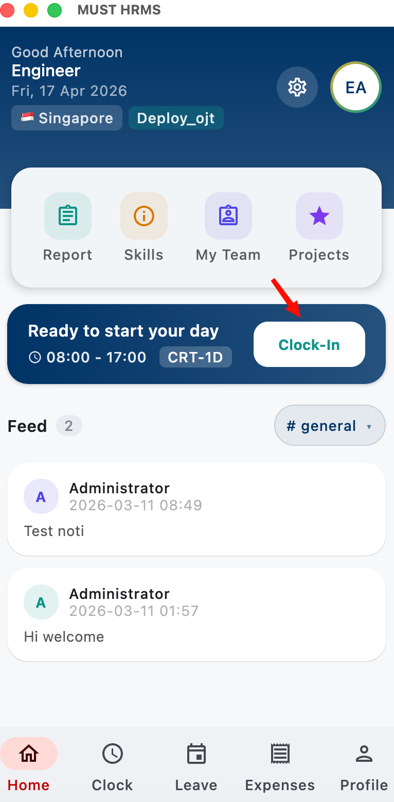

# Clock In / Clock Out
{: .no_toc }

Start and end your workday from the app. The company uses this to calculate your working hours and overtime — so getting it right matters.
{: .fs-5 .fw-300 }

  
Table of contents

  {: .text-delta }
- TOC
{:toc}

---

## Clock in at the start of your shift

1. Open the **MUST Mobile** app.
2. On the **Home** screen, tap the big **Clock In** button.
3. Allow the app to use your location if asked.
4. Wait for the success message. Your clock-in time appears at the top of the screen.

{: .d-block .mx-auto style="max-width: 320px;" }
*The Clock In button is the large white button on the Home screen. Your scheduled shift (e.g. 08:00 - 17:00) shows next to it.*
{: .text-center .fs-3 .text-grey-dk-000 }

**What gets recorded:** your check-in time, GPS location, and the device you used.

## Clock out at the end of your shift

1. Open the app.
2. Tap the **Clock Out** button (same spot where Clock In used to be).
3. Confirm the action.
4. Your total hours for the day appear on screen.

> The Clock-In button turns into **Clock Out** automatically once you've clocked in. You don't need to navigate anywhere else.

## Common issues

### "Location not available"
- Turn on **Location / GPS** in your phone settings.
- Make sure the app has location permission (Settings → Apps → MUST Mobile → Permissions).
- Try again after moving to an area with better GPS signal (near a window, outdoors).

### "Outside geofence"
You're too far from an approved clock-in location. If you're supposed to be working remotely or at a different site, contact HR to update your assigned location.

### Forgot to clock out
Don't panic. Request a correction through HR — they can adjust the record on the back end. **Do not** clock out retroactively by guessing a time.

### App won't load
1. Check your internet (wifi or mobile data).
2. Force-close the app and reopen.
3. Still stuck? Restart your phone.
4. Still stuck? Reinstall the app and log in again.

---

**Next:** [Apply for Leave →](apply-leave.html)
