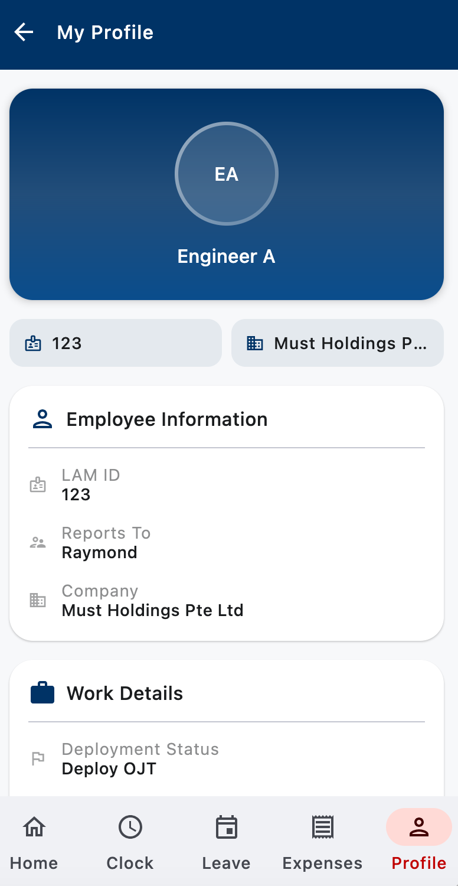

# MUST Mobile Staff Guide
{: .fs-9 }

Everything you need to use the MUST Mobile app on your phone — clock in/out, request leave, submit expenses, and check your attendance.
{: .fs-6 .fw-300 }

[Get it on Google Play](https://play.google.com/store/apps/details?id=asia.technext.musthrms&hl=en){: .btn .btn-primary .fs-5 .mb-4 .mb-md-0 .mr-2 }
[Get it on the App Store](https://apps.apple.com/sg/app/must-hrms/id6759428659){: .btn .fs-5 .mb-4 .mb-md-0 }

{: .d-block .mx-auto style="max-width: 320px;" }
*The Home screen — clock in, see your shift, and open other sections from the bottom nav.*
{: .text-center .fs-3 .text-grey-dk-000 }

---

## A message from the company
{: .fs-6 }

This app is how the company tracks **your attendance, overtime, leave, and expenses** — the same data that directly drives your payroll. It replaces paper timesheets, email claims, and ad-hoc WhatsApp requests with one record you and HR both trust.

**Why clocking in and out on time matters:**

- **Your pay is calculated from this data.** Late clock-in, missing clock-out, or wrong times mean wrong hours — and wrong pay. Fixing it after payroll has closed is slow and painful for everyone.
- **Overtime (OT) needs to be earned on record.** OT only counts if your clock-in/out shows you actually worked beyond your scheduled shift. Work without a record = unpaid work.
- **Your safety.** GPS + timezone data at clock-in tell us which site you're on. If something happens — incident, emergency, site lock-down — we know where you are and can respond.
- **Fairness.** Every colleague is on the same system. Clocking accurately keeps leave, OT, and standby allowances fair across the whole team.

**What we ask of you:**

1. **Clock in** at the start of your shift, **at the site** (not from home on the way there).
2. **Clock out** at the end of your shift, before you leave.
3. If you forget, **don't guess** — use the amend-time feature in the Schedule screen (long press the day) and your manager will review.
4. Keep **Location** and **Notifications** permissions **always on** — they are not optional for this app to work correctly.
5. If anything on your profile is wrong (LAM ID, manager, company), tell HR immediately.

If you're ever unsure, ask HR. It's always better to ask than to guess.

---

## What you'll learn

| Section | What it covers |
|:--------|:---------------|
| [Clock In / Clock Out](clock-in-out.html) | Start and end your workday from your phone |
| [Apply for Leave](apply-leave.html) | Submit annual, sick, and other leave requests |
| [Submit Expenses](apply-expenses.html) | File expense claims with receipts |
| [Attendance & Schedule](attendance.html) | Check your records, shifts, and working hours |

## Before you start

1. **Install the app** from Google Play or the App Store (links above).
2. **Log in** with your company email and the password HR gave you.
3. **Allow location and notification permissions** when prompted — these are needed for clock-in and shift reminders.

{: .d-block .mx-auto style="max-width: 320px;" }
*After logging in, the Profile tab shows your LAM ID, manager, and company. If anything here is wrong, tell HR.*
{: .text-center .fs-3 .text-grey-dk-000 }

> **Forgot password or can't log in?** Contact HR. Do not create a second account.

## Need help?

If something in this guide doesn't match what you see in the app, or your action isn't going through, contact HR directly. Most issues are permission, network, or account-setup related and can be fixed in a few minutes.

---

_Last updated: {{ site.time | date: "%B %Y" }}_
